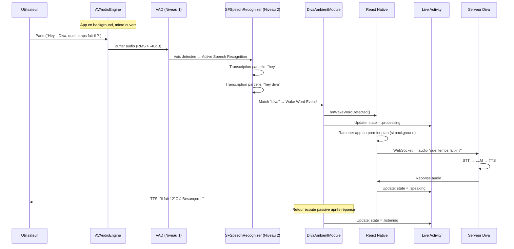

# ADR-004 — Architecture du mode Ambient (Background Wake Word)

**Date:** 2026-03-11
**Auteur:** Winston (Architecte BMAD)
**Statut:** Accepté
**Brief source:** `docs/brief-diva-ambient.md` (Mary)

---

## Contexte

Diva doit fonctionner comme un assistant ambiant : l'utilisateur lance l'app une fois, puis elle écoute en arrière-plan. Le mot-clé "Diva" déclenche une session vocale, même depuis le lock screen ou une autre app. C'est la feature fondamentale qui différencie Diva d'un simple chatbot vocal.

## Décision

### D1 — Module natif Swift (pas de bridge JS pour l'audio background)

**Choix :** Expo Module API (Swift natif) pour tout le pipeline audio background.

**Raison :** `@react-native-voice/voice` a déjà causé un crash TurboModule au démarrage (v14). Le background audio sur iOS nécessite un contrôle fin de `AVAudioSession`, `AVAudioEngine`, et `SFSpeechRecognizer` qui ne peut pas passer par des bridges JS sans risque de latence et d'instabilité.

**Conséquence :** Le module `DivaAmbientModule` sera un Expo Module natif Swift avec une API JS minimale :
```typescript
// API exposée à React Native
DivaAmbient.startListening(): Promise<void>
DivaAmbient.stopListening(): Promise<void>
DivaAmbient.isListening(): Promise<boolean>
DivaAmbient.getStatus(): Promise<AmbientStatus>

// Events émis vers JS
DivaAmbient.onWakeWordDetected → () => void
DivaAmbient.onStatusChange → (status: AmbientStatus) => void
DivaAmbient.onError → (error: string) => void
```

**Alternative rejetée :** Garder `@react-native-voice/voice` — trop instable en background, crash TurboModule, pas de contrôle sur AVAudioSession.

---

### D2 — Détection wake word à 2 niveaux (VAD + SFSpeech)

**Choix :** Architecture à 2 niveaux pour optimiser la batterie.

```
┌─────────────────────────────────────────────────┐
│                 AVAudioEngine                    │
│           (toujours actif, tap bus input)        │
│                                                  │
│  ┌───────────────┐    ┌───────────────────────┐ │
│  │  Niveau 1     │    │  Niveau 2             │ │
│  │  VAD (RMS)    │───▶│  SFSpeechRecognizer   │ │
│  │  ~2% CPU      │    │  ~15% CPU             │ │
│  │  Toujours ON  │    │  ON quand voix        │ │
│  │               │    │  OFF après 5s silence  │ │
│  └───────────────┘    └───────────┬───────────┘ │
│                                   │              │
│                          "diva" détecté?         │
│                                   │              │
│                          ┌────────▼────────┐     │
│                          │ Wake Word Event │     │
│                          │ → JS callback   │     │
│                          └─────────────────┘     │
└─────────────────────────────────────────────────┘
```

**Niveau 1 — VAD (Voice Activity Detection) :**
- Tap sur `AVAudioEngine.inputNode` avec buffer 4096 samples
- Calcul RMS (Root Mean Square) de l'amplitude
- Seuil : -40 dB (configurable)
- Si amplitude > seuil pendant > 200ms → active Niveau 2
- Coût CPU : ~2%, batterie : ~3%/heure

**Niveau 2 — Speech Recognition :**
- `SFSpeechRecognizer(locale: Locale(identifier: "fr-FR"))`
- `SFSpeechAudioBufferRecognitionRequest` avec `shouldReportPartialResults = true`
- Cherche "diva" dans les résultats partiels (case-insensitive)
- Timeout : 5 secondes sans voix → désactive
- Limite Apple : restart automatique toutes les 60s (limite système)

**Raison :** Le Speech Recognition consomme ~15% CPU. Le VAD filtre 90%+ du temps (silence, bruit ambiant), réduisant la consommation effective à ~4-5%/heure.

---

### D3 — AVAudioSession Configuration

```swift
let session = AVAudioSession.sharedInstance()
try session.setCategory(
    .playAndRecord,
    mode: .voiceChat,
    options: [.defaultToSpeaker, .mixWithOthers, .allowBluetooth]
)
try session.setActive(true, options: .notifyOthersOnDeactivation)
```

**Options critiques :**
- `.playAndRecord` : requis pour background audio avec micro
- `.mixWithOthers` : Diva n'interrompt pas la musique/podcast
- `.allowBluetooth` : support AirPods/écouteurs BT
- `.defaultToSpeaker` : TTS sort sur le haut-parleur par défaut

**Interruptions :**
```swift
NotificationCenter.default.addObserver(
    forName: AVAudioSession.interruptionNotification
) { notification in
    // Appel téléphonique, Siri, etc.
    // → Pause VAD + Speech Recognition
    // → Reprendre quand interruption termine
}
```

---

### D4 — Live Activity + Dynamic Island via ActivityKit

**Choix :** `ActivityKit` pour les Live Activities, `WidgetKit` pour le widget fallback.

**Structure :**
```
ios/
  DivaAmbient/
    DivaAmbientModule.swift          ← Expo Module (audio + VAD + speech)
    DivaAmbientModule.m              ← ObjC bridge header
  DivaLiveActivity/
    DivaLiveActivity.swift           ← ActivityKit Live Activity
    DivaLiveActivityAttributes.swift ← Modèle de données
    DivaLiveActivityBundle.swift     ← Widget Extension entry
  DivaWidget/
    DivaWidget.swift                 ← Lock screen widget (fallback)
```

**États de la Live Activity :**
```swift
enum DivaAmbientState: Codable {
    case listening      // Écoute passive — orbe respire doucement
    case voiceDetected  // VAD actif — orbe pulse
    case processing     // Wake word détecté, traitement — orbe animé
    case speaking       // TTS en cours — waveform
    case paused         // App en pause (interruption)
    case error          // Erreur — icône warning
}
```

**Dynamic Island layouts :**
- **Compact (minimal) :** Petit orbe coloré (8pt) — indique que Diva écoute
- **Compact (leading) :** Icône Diva
- **Compact (trailing) :** État texte ("Écoute...")
- **Expanded :** Orbe animé + état + bouton micro

---

### D5 — Communication natif → JS

**Choix :** Expo Modules Event Emitter (pas de bridge RCT legacy).

```swift
// Swift → JS
class DivaAmbientModule: Module {
    func definition() -> ModuleDefinition {
        Name("DivaAmbient")
        
        Events("onWakeWordDetected", "onStatusChange", "onError")
        
        AsyncFunction("startListening") { ... }
        AsyncFunction("stopListening") { ... }
        AsyncFunction("isListening") { ... }
        AsyncFunction("getStatus") { ... }
    }
}
```

```typescript
// JS side
import { DivaAmbientModule } from './modules/diva-ambient';

DivaAmbientModule.addListener('onWakeWordDetected', () => {
    // Ramener l'app au premier plan si besoin
    // Démarrer la session vocale (WebSocket → serveur)
});
```

---

### D6 — Gestion du cycle de vie background

```
┌──────────┐     ┌──────────────┐     ┌─────────────┐
│ Foreground│────▶│  Background   │────▶│ Suspended/   │
│ (normal)  │     │  (audio BG)  │     │  Killed      │
└──────────┘     └──────────────┘     └─────────────┘
     │                  │                     │
     │  AVAudioEngine   │  AVAudioEngine      │  Widget
     │  + VAD + Speech  │  + VAD + Speech     │  fallback
     │  + Full UI       │  + Live Activity    │  "Tap pour
     │                  │  + Dynamic Island   │   relancer"
     │                  │                     │
     ▼                  ▼                     ▼
  Tout normal      Point orange          Notification
                   visible               "Diva en pause"
```

**Stratégie de survie background :**
1. AVAudioEngine avec tap actif = iOS maintient l'app vivante
2. Si iOS suspend quand même (>5min sans audio) → BGProcessingTask comme backup
3. Si iOS kill → le widget WidgetKit détecte l'absence et affiche "Relancer"
4. Notification locale programmée toutes les 4h : "Diva est toujours là 👋" (optionnel, configurable)

---

## Diagramme de séquence — Wake Word Flow



---

## Estimation batterie

| Composant | CPU | Batterie/heure | Notes |
|-----------|-----|----------------|-------|
| AVAudioEngine (tap) | ~1% | ~1% | Buffer minimal |
| VAD (RMS calculation) | ~1-2% | ~2% | Calcul léger |
| SFSpeech (quand voix) | ~10-15% | ~5% | Actif ~30% du temps |
| Live Activity | <1% | <1% | Refresh limité |
| **Total idle** | **~3%** | **~3-4%** | Silence/bruit |
| **Total actif** | **~15%** | **~8%** | Conversation |

**Estimation journée type :** Si l'utilisateur a Diva active 16h/jour avec ~10% du temps en conversation → ~5% batterie/heure moyen → ~80% batterie/jour consommée par Diva.

**⚠️ C'est beaucoup.** Recommandation : mode "Smart" par défaut qui se désactive quand batterie < 30%.

---

## Risques techniques et mitigations

| Risque | Mitigation |
|--------|-----------|
| SFSpeechRecognizer timeout 60s | Restart automatique dans le handler `didFinish` |
| AVAudioEngine interrompu (appel) | Observer `interruptionNotification`, reprendre après |
| iOS kill app en background | Widget fallback + BGProcessingTask restart |
| Faux positifs "diva" | Cooldown 2s + vérification confidence score > 0.7 |
| App Store rejection | Privacy manifest + description claire + précédent ChatGPT |
| Batterie excessive | Mode Smart (auto-pause < 30% batterie) |

---

## Verdict

✅ **Architecture validée.** Le brief de Mary est solide. La stratégie VAD + SFSpeech à 2 niveaux est le bon compromis performance/batterie. Le module natif Swift via Expo Modules est le seul choix viable (exit `@react-native-voice/voice`).

**Priorité d'implémentation :**
1. `DivaAmbientModule.swift` — AVAudioEngine + VAD + SFSpeech
2. Hook `useDivaAmbient.ts` — bridge JS
3. Live Activity + Dynamic Island
4. Widget fallback

**Prochaine étape :** Bob (SM) pour découper en stories dev-ready et planifier le sprint.
